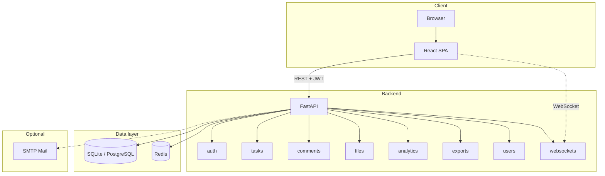
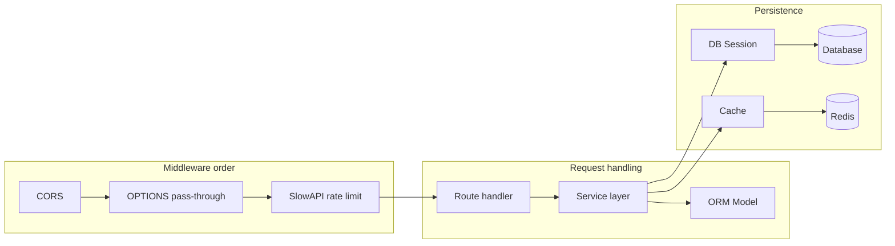
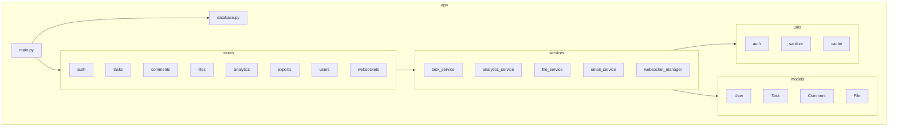
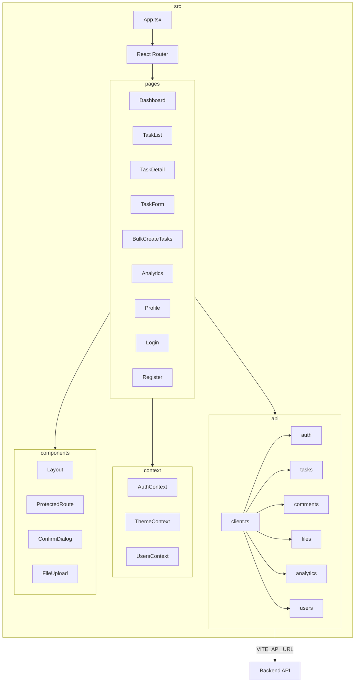
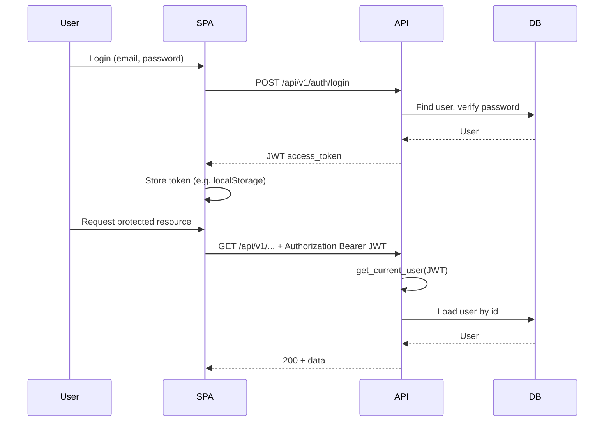
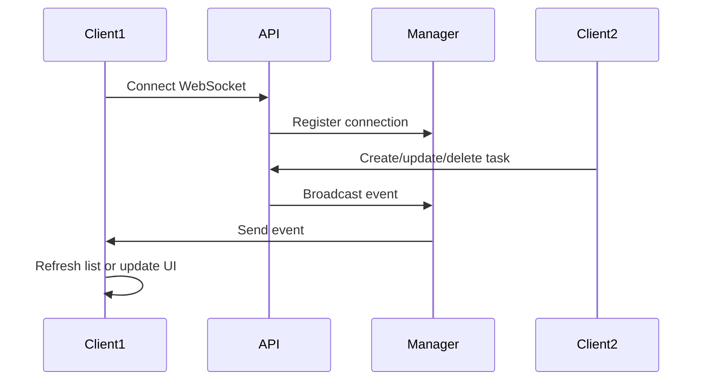

# Task Management System — Architecture

This document describes the high-level architecture and main data flows.

---

## System overview

- **Client:** React + TypeScript + Vite SPA; talks to backend via REST (JWT in `Authorization` header) and optionally WebSocket for real-time task events.
- **Backend:** FastAPI app; routers for auth, tasks, comments, files, analytics, exports, users, websockets. Uses SQLAlchemy for DB and Redis for cache (with in-memory fallback).
- **Optional:** Email (e.g. task assigned/completed) via SMTP when configured.

---

## Backend request flow

- **Middleware:** CORS first, then OPTIONS pass-through (so preflight is not rate-limited), then SlowAPI (e.g. 100 req/min per IP).
- **Request path:** Route (e.g. `routes/tasks.py`) → service (e.g. `services/task_service.py`) → model + DB session. Schemas (Pydantic) validate request/response; routes depend on `get_current_user` for protected endpoints.
- **Cache:** Used for analytics (and optionally task list); Redis with in-memory fallback when Redis is unavailable.

---

## Backend structure

- **main.py:** Mounts routers, middleware, startup (DB create_all, cache init), exception handlers.
- **routes/*:** HTTP handlers; call services and return schemas.
- **services/*:** Business logic, file storage, WebSocket broadcast, optional email.
- **models/*:** SQLAlchemy models (User, Task, Comment, File).
- **utils/*:** JWT/password (auth), input sanitization, cache helpers.

---

## Frontend structure

- **App + Router:** Entry and route definitions; protected routes use `ProtectedRoute`.
- **pages/*:** Dashboard, task list/detail/form, bulk create, analytics, profile, login/register. They use `api/*` and `context/*`.
- **api/*:** `client.ts` sets base URL and JWT header; domain modules (auth, tasks, comments, files, analytics, users) call backend.
- **context/*:** Auth (user + token), theme (light/dark), users list (e.g. assignee dropdown).
- **components/*:** Layout, ProtectedRoute, ConfirmDialog, FileUpload, etc.

---

## Authentication flow

- Login returns a JWT; frontend stores it and sends it in the `Authorization` header.
- Protected routes use FastAPI dependency `get_current_user` (decode JWT, load user from DB).

---

## Real-time updates (WebSocket)

- Backend: `WebSocketManager` keeps active connections; task create/update/delete handlers call broadcast.
- Frontend: `services/socket.ts` (or similar) connects and subscribes; on message, refresh task list or update local state.

---

## File references

| Layer   | Key paths |
|--------|-----------|
| Backend entry | [backend/app/main.py](backend/app/main.py) |
| Backend DB    | [backend/app/database.py](backend/app/database.py) |
| Backend routes | [backend/app/routes/](backend/app/routes/) |
| Backend services | [backend/app/services/](backend/app/services/) |
| Frontend API  | [task-management-frontend/src/api/client.ts](task-management-frontend/src/api/client.ts) |
| Frontend auth | [task-management-frontend/src/context/AuthContext.tsx](task-management-frontend/src/context/AuthContext.tsx) |

For setup and run instructions, see [README.md](README.md).
